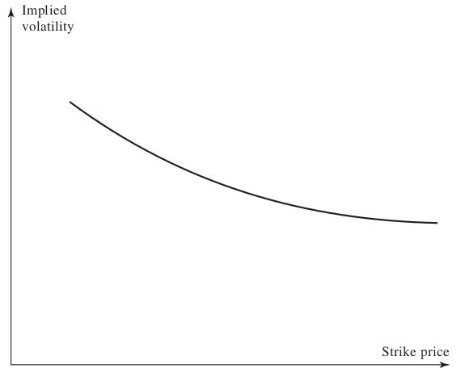
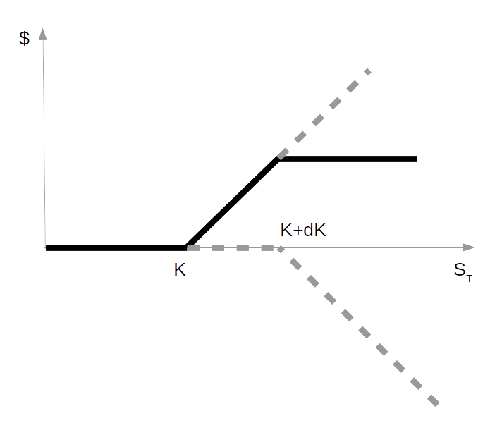
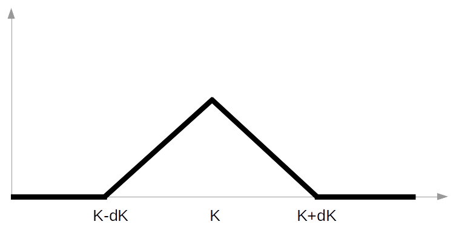

# Smile de Volatilidade {#smile}

A volatilidade instantânea, $\sigma$, do ativo subjacente é a única variável no modelo B&S que não pode ser diretamente observada. De fato, a volatilidade (ou equivalentemente a variância) de um ativo é dita uma variável **latente**. Sabemos que ela existe e possui algum valor no processo gerador, o processo pelo qual os preços são formados, porém não conseguimos observá-la diretamente, apenas estimá-la. Uma das formas de estimação de volatilidade pode ser a partir de dados históricos, mas várias outras formas existem, entre elas processos GARCH, volatilidade realizada, volatilidade estocástica, etc.

Uma vez que a volatilidade não pode ser diretamente observada, a prática comum no mercado é fazer o caminho inverso. Considerar os preços de mercado para as opções como dado, e a partir do modelo [B&S](#bsm) inverter a equação de preço da Call ou Put para encontrar a volatilidade deste modelo que é compatível com os preços de mercado. A esta volatilidade encontrada damos o nome de **volatilidade implícita**.

Portanto, o smile de volatilidade que tratamos neste post é na verdade um gráfico entre a volatilidade implícita, retirada de opções Européias (baunilhas, do inglês vanilla options) a partir do modelo B&S, contra os _strikes_ destas opções. 

## Reparametrizando B&S e definição de moneyness {#reparametrizando}

Nem sempre é interessante plotar o smile contra os _strikes_ propriamente ditos, uma forma de avaliar o quanto uma opção está "dentro, fora ou no dinheiro" pode ser a grega Delta ou então o chamado _moneyness_ (por favor, se alguém tiver uma boa tradução para este termo, deixe nos comentários). Tradicionalmente a medida de _moneyness_ é a relação $K/S$, ou seja o strike contra o preço corrente do subjacente. Porém existem outras definições mais interessantes para se trabalhar, entretanto, antes devemos fazer uso de algumas definições e vamos reparametrizar as expressões $d1$ e $d2$ do modelo [B&S](#bsm).

Lembrando que em precificação de opções estamos no mundo neutro ao risco, vamos definir o valor _forward_, $F$ do subjacente como o valor corrente composto pela taxa livre de risco até a maturidade da opção, ou seja:

\begin{equation}
F=e^{r\tau}S
\end{equation}

A **volatilidade (implícita) total** pode ser definida como a volatiliade reescalada pela raiz do tempo, que nos dá uma informação da volatiliade esperada para o subjacente do período corrente até a maturidade. Da mesma forma, a **variância total**. Denotanto a volatilidade total por $\theta$ e a variância total por $w$, temos:

\begin{equation}
\theta=\sigma_{imp}\cdot \sqrt{\tau} 
(\#eq:voltotal)
\end{equation}

e

\begin{equation}
w=\sigma_{imp}^2\cdot\tau
(\#eq:vartotal)
\end{equation}

Vamos também definir a medida _forward log-moneyness_ e denotá-la por $k$. Esta será a medida de _moneyness_ que iremos utilizar ao longo deste e de outros artigo, portanto iremos utilizar este termo para designar o _forward log-moneyness_ a não ser que expresso de forma contrária no texto.

\begin{equation}
k=\ln\left(\frac{K}{S}\right)-r\tau=\ln\left(\frac{K}{F}\right)
(\#eq:flmoneyness)
\end{equation}

Logo, o _strike_ está relacionado ao _moneyness_ de forma que: $K=Fe^k$.

Podemos agora reparametrizar as expressões $d1$ e $d2$ do modelo B&S de forma que serão mais facilmente trabalhadas em modelos de volatilidade. Lembrando destas expressões que já foram apresentadas no Capítulo \@ref(bsm):

\begin{align}
&d_{1}={\frac {\ln(S/K)+(r+\sigma ^{2}/2)(\tau)}{\sigma {\sqrt {\tau}}}}\\
&d_{2}={\frac {\ln(S/K)+(r-\sigma ^{2}/2)(\tau)}{\sigma {\sqrt {\tau}}}}=d_1-\sigma\sqrt{\tau}
\end{align}

Substituindo as expressões para _forward log-moneyness_ e volatilidade total nas definições acima temos as novas parametrizações para $d1$ e $d2$:

\begin{equation}
d_{1}={-\frac{k}{\theta}+\frac{\theta}{2}}
(\#eq:d1mod)
\end{equation}

\begin{equation}
d_{2}={-\frac{k}{\theta}-\frac{\theta}{2}}=d_1-\theta
(\#eq:d2mod)
\end{equation}

Retomando o valor da opção do tipo Call no modelo B&S, podemos reescrever sua fórmula de apreçamento da seguinte forma:

\begin{equation}
\begin{aligned}
C(K, \tau)=&SN(d1)-Ke^{-r\tau}N(d2)\\
e^{r\tau}C(K, \tau)=&FN(d1)-KN(d2)\\
C_B=&F\left[N(d1)-e^kN(d2)\right]
\end{aligned}
(\#eq:cblack)
\end{equation}

Esta equação é conhecida como a forma de Black de precificação _(Black Call price formula)_, que relaciona os valores _forward_ da opção (também conhecido como valor não descontado), do subjacente e do _strike_. Esta formulação é particularmente útil quando formos extrair a distribuição neutra ao risco do subjacente que está implícita nos preços de mercado das opções.

## Características de smiles de volatilidade {#caracsmile}

Caso o modelo de Black, Schole e Merton estivesse em acordo com a realidade, e os ativos tivessem seus preços formados a partir de um verdadeiro MBG, a volatilidade implícita seria uma constante. O gráfico do smile de volatilidade seria uma reta horizontal, com a mesma volatilidade para qualquer nível de _moneyness_ e se considerarmos a superfície toda (que leva em conta os diversos tempos para expiração) esta seria paralela ao domínio $(k, \tau)$. Não estaríamos escrevendo (e você lendo) este artigo se este fosse o caso...

O fato é que o modelo B&S é um modelo muito restritivo, com inúmeras suposições que não se verificam no mundo real e que por conseguinte, tornam os resultados do modelo pouco acurados. Entretanto este é um modelo muito conhecido, de fácil assimilação por parte dos agentes de mercado e que virou a língua franca nos mercados de derivativos. Se todos os _traders_ conversarem em termos do modelo B&S, todos se entenderão, mesmo que internamente cada um possua seu próprio modelo de apreçamento.

Entre as características tipicamente observadas em smiles (e superfícies) de volatilidades pode-se citar:

- As volatilidades implícitas variam conforme o _strike_  e prazo de expiração
- Smiles apresentam _skew_. Maior inclinação em uma das asas, representando uma maior probabilidade daqueles _strikes_ acontecerem
- Smiles de equity tipicamente são negativos
- Mercados diferentes apresentam padrões de smile diferentes

### Mercados cambiais

Opções sobre moedas possuem tipicamente um smile de volatilidade conforme mostrado na figura \@ref(fig:smile-cambial) abaixo. A volatilidade implícita é relativamente baixa para opções ATM. Esta torna-se progressivamente maior quando a opção se move para dentro do dinheiro ou para fora.

(\#fig:smile-cambial)Smile típico de um mercado cambial.

Caso a distribuição dos preços do ativo subjacente, neste caso uma taxa de câmbio fosse perfeitamente log-normal como no modelo B&S, o smile não teria esta curvatura. Desta forma podemos afirmar que o mercado, ao precificar as opções, acredita que a distribuição deste ativo possui caudas com maior densidade que supõe a log-normal, existem maiores probabilidades de retornos muito baixos ou muito altos.

### Mercados de _equities_

Nos mercados de _equities_, ações, índices de ações e ETFs, por exemplo, o smile apresenta uma característica de assimetria (skew, em inglês) negativa. A asa esquerda (parte onde as puts estão fora do dinheiro) apresenta valores de volatilidade implícita muito maiores que suas contrapartes no lado das calls. Este comportamento reflete a percepção de mercado de uma maior probabilidade de grandes perdas nas ações que altos ganhos, gerando portanto, uma distribuição de preços assimétrica. Como existe uma maior probabilidade de perdas extremas, o seguro para estas, ou seja, uma put é relativamente mais cara que uma call.

(\#fig:smile-equities)Smile típico de uma ação ou índice de ações.

## Smile como forma de precificação {#smileprecificacao}

Analisando a equação de B&S com a parametrização para $d1$ e $d2$ dada no início deste artigo é possível verificar que existe uma relação direta entre volatilidade implícita e preço de uma opção, seja esta uma call ou put. 

Como $d1$ é estritamente crescente em $\theta$ e $d2$ é estritamente decrescente  e ao mesmo tempo o preço de uma opção é crescente em d1 e decrescente em d2, logo, temos uma relação direta entre o preço de uma opção e sua volatilidade implícita para uma dada maturidade. Em outras palavras, em um smile, tudo o mais constante, quanto maior a volatilidade implícita maior o preço da opção naquele _strike_.

Outra forma de verificar esta relação é perceber que a grega Vega, que é calculada da mesma forma para calls e puts, é sempre positiva. Ou seja, um aumento no valor da volatiliade sempre leva a elevações no preço de uma opção.

Desta forma é normal entre os praticantes de mercado fazer a precificação de opções em termos de "pontos de volatilidade" e não em valores monetários propriamente ditos. Isto porque o modelo B&S, apesar de não ser o modelo correto (nenhum é) para a precificação de opções, é conhecido e de fácil entendimento para todos. Então todos os praticantes podem fazer suas cotações em termos de volatilidades implícitas, que são extraídas de opções baunilhas com o modelo B&S, e somente na hora de fechar um negócio e liquidar o pagamento, o preço efetivo a ser pago é acordado entre as partes.

## Estrutura a termo

O mercado precifica a volatilidade implícita de forma que esta dependa também do tempo até expiração, bem como do preço de exercício, agregando uma segunda dimensão ao smile e transformando-o na famigerada **superfície de volatilidade implícita**.

A volatilidade implícita tende a ser uma função crescente da maturidade quando as volatilidades de curto prazo são historicamente baixas e função decrescente da maturidade quando as volatilidades de curto prazo são historicamente altas. Isso porque existe uma expectativa de reversão a uma média de longo prazo embutida na volatilidade. Esta característica é explorada explicitamente por alguns modelos de volatilidade, como em @Heston1993.

As superfícies de volatilidade combinam smiles com a estrutura a termo de volatilidade para tabular valores apropriados para precificar uma opção com qualquer preço de exercício e prazo de expiração.

Da mesma forma como a curva de juros em um dado momento é uma descrição concisa dos preços dos títulos negociados naquele mercado, assim, para um ativo subjacente em particular em determinado momento, a superfície de volatilidade implícita fornece uma descrição resumida de seu mercado de opções. Considerando que os rendimentos dos títulos são diferenciados pelo seu tempo até o vencimento, as opções são diferenciadas por seu tempo até a expiração e o _strike_, logo  requerem uma superfície ao invés de uma curva.

A figura \@ref(fig:superficie) demonstra uma superfície de volatilidade implícita  do `SPX` em 15/09/2005, conforme apresentado em @Gatheral2011.

(\#fig:superficie)Superfície de volatilidade implícita.

## Arbitragem estática {#arbestatica}

Antes de definir o que é arbitragem estática que pode estar presente em uma superfície de volatilidade (ou na superfície de preço de opções), vamos partir para a intuição por trás desta definição. 

O princípio de ausência de arbitragem é dominante na teoria financeira. Este princípio nos informa que não deve existir lucro sem que se incorra em algum tipo de risco, o lucro sempre é a remuneração do investidor que aceitou carregar alguma forma de risco durante o investimento. Portanto, não devem existir perfis de lucro acima da taxa livre de risco (_payoffs_ positivos) com probabilidade de 100%.

Primeiro consideramos uma trava de alta com opções do tipo call. Excluindo-se os custos de transação, esta operação sempre oferece um retorno positivo ou zero, conforme a figura \@ref(fig:trava-alta). Por mais que esta estratégia esteja montada fora do dinheiro, sempre existe uma possibilidade de ela ter lucro, $S_T>K$ e portanto seu preço deve ser sempre maior que zero. 

(\#fig:trava-alta)Perfil de lucro de uma trava de alta.

É claro que quanto mais ITM estejam as opções, maior seu preço e quanto mais fora do dinheiro menor será seu valor até o limite inferior zero. Se levarmos a diferença entre os _strikes_, $dK$ a zero temos que:

\begin{equation}
\frac{\partial C}{\partial K}\leq 0
\end{equation}

Este é o limite de arbitragem para travas de alta ou, mais conhecido pelo termo em inglês _call spread no-arbitrage_ e impõe que os preços das calls devem ser uma função descrescente no _strike_. De forma equivalente e através da [paridade compra-venda](#putcalparity) este limite de arbitragem para as puts é:

\begin{equation}
\frac{\partial P}{\partial K}\geq 0
\end{equation}

### Arbitragem de borboleta

Também deve ser imposta uma restrição na segunda derivada do preço das opções em relação ao _strike_, e esta é conhecida como limite de arbitragem para borboletas. Vejamos porquê. 

Considere uma estratégia do tipo borboleta, onde se compra uma quantia de calls no _strike_ $K-dK$, vende-se duas vezes esta quantia em $K$ e compra-se novamente um lote em $K+dK$, o perfil de lucro desta operação no vencimento está representado na figura \@ref(fig:borboleta).

(\#fig:borboleta)Borboleta realizada com calls.

Seguindo a mesma linha de raciocínio anterior, como o _payoff_ da borboleta é sempre não negativo também deve ser o seu valor para qualquer período anterior a expiração. Se denotarmos $\pi_B$ o valor da borboleta, então $\pi_B\geq0$.

Agora imagine que escalamos a estratégia de forma que um lote de compras (na venda são dois lotes) seja de tamanho $1/dK^2$, o valor para a montagem desta operação deve ser, portanto:

\begin{equation}
\pi_B=\frac{C(K-dK)-2C(K)+C(K+dK)}{dK^2}
\end{equation}

E se levarmos ao limite em que $dK\rightarrow 0$, a equação acima torna-se justamente a segunda derivada do preço da call no _strike_ $K$.

\begin{equation}
\begin{aligned}
\frac{\partial^2 C(K)}{\partial K^2}=& \pi_B\\
\geq & 0
\end{aligned}
(\#eq:arbborboleta)
\end{equation}

Ou seja, os preços das calls são uma função **convexa** nos _strikes_. O mesmo raciocínio pode ser feito para uma borboleta com puts e o resultado será equivalente, o preço das puts também deve ser uma função convexa nos _strikes_.

### Arbitragem de calendário

Passamos agora a analisar os limites de arbitragem na estrutura a termo da superfície de volatilidade. A arbitragem de calendário normalmente é expressa em termos de monotonicidade dos preços em relação ao período para expiração. Ou seja, quanto maior o prazo de maturidade de uma opção para um mesmo preço de exercício, maior deve ser seu valor.

É fácil de entender este limite com base nas probabilidades de exercício. Como sabemos, em um [processo estocástico](#processos-estocasticos) do tipo MBG a variância do processo cresce conforme a **raiz do tempo**, $\sqrt{\tau}$. Quanto maior a variância do ativo subjacente, maior a probabilidade deste alcançar um determinado preço, mais elevado ou não. Assim, seja uma call ou put OTM quanto mais distante estiver seu prazo de maturidade, maior a probabilidade de exercício e portanto, maior seu valor.

Dado que a relação de **volatilidade total** implícita e preço de uma opção também é direta e positiva, conforme demonstrado na Seção \@ref(smileprecificacao), segue que a volatilidade total deve ser não decrescente no tempo para expiração. 

Esta relação pode ser expressa através da seguinte equação para uma call precificada através de B&S:

\begin{equation}
\frac{\partial C_{BS}(k, \theta(\tau))}{\partial \tau}=\partial_\theta C_{BS}\cdot\partial_\tau \theta \geq 0
(\#eq:arbcalendario)
\end{equation}

onde $\partial_\theta C_{BS}$ é a derivada parcial do preço da call em relação a volatilidade total implícita, que já demonstramos ser positiva e $\partial_\tau \theta$ é a derivada parcial da volatilidade total implícita em relação ao tempo para maturidade que, portanto, deve ser maior ou igual a zero para obedecer a restrição imposta ao preço da call.

## Limites de inclinação

Se mantivermos a volatilidade implícita constante para todos os _strikes_, os preços das calls no modelo B&S devem ser decrescentes. Por outro lado, para um _strike_ fixo, o preço de uma call se eleva à medida que a volatilidade implícita aumenta. Suponha por um momento que a volatilidade implícita varia com o _strike_ como é o caso nos smiles. À medida que o _strike_ aumenta, se a volatilidade implícita aumentar muito rapidamente, seu efeito sobre o preço da call pode mais que compensar o declínio no preço devido a elevação do preço de exercício e, assim, levar a um aumento líquido no preço da opção. Isso violaria o requisito de que $\partial C /\partial K \leq 0$ e, portanto, leva a um limite superior na taxa em que a volatilidade implícita pode aumentar com o strike.

Novamente, o mesmo raciocínio pode ser imposto para o lado das puts. A volatilidade implícita não pode se elevar tão rapidamente quando os _strikes_ se reduzem de forma que uma put de _strike_ menor tenha valor mais elevado que outra que esteja mais próxima do dinheiro.

Finalmente, um sumário dos limites impostos a uma superfície de preços de opções (calls no caso apresentado), que implicam em limites para a superfície de volatilidade é apresentado abaixo[^54]:

1. $\partial_\tau C \geq 0$
2. $\lim\limits_{K\rightarrow\infty}C(K, \tau)=0$
3. $\lim\limits_{K\rightarrow-\infty}C(K, \tau)+K=a, \quad a \in \mathbb R$
4. $C(K, \tau)$ é convexa em $K$
5. $C(K, \tau)$ é não-negativa

## Distribuição implícita {#rnd}

O modelo B&S é baseado na suposição que o ativo subjacente segue uma distribuição log-normal em seus preços. Caso esta suposição fosse de fato realizada no mercado, o smile de volatilidade seria uma reta completamente horizontal, não haveria variação na volatilidade implícita conforme o preço de exercício. Entretanto, esta não é a realidade dos smiles e podemos fazer a pergunta inversa portanto, qual a distribuição neutra ao risco que está implícita no smile de volatilidade?

Certamente não é uma log-normal. Na verdade, a densidade da distribuição que está implícita em um smile nada mais é que a convexidade deste smile, ou seja, sua segunda derivada em relação ao _strike_. Esta distribuição implícita também é por vezes chamada de RND _(risk neutral density)_ e é muito útil para fazer a precificação de outras opções que não são observadas no smile ou extrair probabilidades de ocorrência de eventos precificadas pelo mercado.

Pode-se obter este resultado a partir da definição do valor de uma call e é conhecido como a fórmula de @Breeden1978. O valor de uma call é o valor esperado do _payoff_ terminal desta call ponderado pela densidade neutra ao risco do subjacente. Ou seja:

\begin{equation}
C(S, t)=e^{-r\tau}\int\limits_{0}^\infty p(S,t,S_T,T)\max\{S_T-K, 0\}dS_T
\end{equation}

onde $p(\cdot)$ é a densidade neutra ao risco e estamos supondo uma taxa de juros livre de risco constante durante o período de vida da opção. Como o _payoff_ da call é não linear, sendo zero para qualquer valor de $S_T \leq K$ e igual a $S_T-K$ quando $S_T > K$, podemos escrever esta equação como:

\begin{equation}
C(S, t)=e^{-r\tau}\int\limits_{K}^\infty p(S,t,S_T,T)(S_T-K)dS_T
\end{equation}

que pode ser rearranjada, com alguma simplificação na notação, da seguinte forma.

\begin{equation}
\begin{aligned}
\frac{\partial C}{\partial K}=& -e^{-r\tau}\int\limits_{K}^\infty p(S_T)dS_T\\
e^{r\tau}\frac{\partial C}{\partial K}=& \int\limits_{-\infty}^K p(S_T)dS_T\\
e^{r\tau}\frac{\partial^2 C}{\partial K^2}=& \ p(K)\\
\frac{\partial^2 C_B}{\partial K^2}=& \ p(K)
\end{aligned}
(\#eq:distimplicita)
\end{equation}

Onde usou-se a notação $C_B$ para denotar a formulação de Black para o preço de uma call. Ou seja, a segunda derivada em relação ao strike do preço não descontado de uma call é a distribuição neutra ao risco do ativo subjacente, e é válida para todos preços de exercício.

Portanto, se desejarmos saber qual a distribuição de probabilidades de preços do ativo subjacente em uma data futura que possua vencimento de opções, basta encontrarmos a convexidade do smile dos preços _forward_ daquele vencimento[^55].

## Conclusão

O modelo de Black-Scholes-Merton, pode ser considerado a pedra fundamental para a precifição de opções. Entretanto, este modelo apresenta uma séries de limitações que fazem com que os praticantes de mercado utilizem outras técnicas neste mercado. Uma destas é o uso do smile de volatilidade e sua interpretação como forma de precificar opções e extrair informações implícitas nos preços.

A assimetria do smile e suas asas informam que as distribuições de probabilidades para o ativo subjacente não são exatamente log-normais, e podem apresentar discrepâncias significativas, especialmente nas caudas da distribuição que muito interessam a gestão de risco, por exemplo.

Este foi um artigo denso, porém com vários conceitos importantes para a compreensão do comportamento da superfície de volatilidade. A estrutura a termo também é existente na volatilidade implícita e está limitada pela ausência de arbitragem do tipo calendário. O smile de volatilidade, que é uma fatia da superfície com prazo de expiração constante, possui suas próprias limitações de forma, com a ausência de arbitragem do tipo borboleta e limitações quanto a inclinação.

Por fim, foi demonstrado como a convexidade do smile de preços fornece a distribuição implícita para os preços do ativo subjacente para a data de expiração das opções.

[^54]: Retirado de @Aurell2014, p. 25.
[^55]: Simples em teoria, muito mais complicado na prática, com diversos problemas para a extrapolação do smile para _strikes_ extremos.

