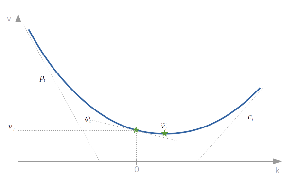

# Superfície SVI {#ssvi}

```{r setup_ssvi, include=FALSE}
knitr::opts_chunk$set(echo = TRUE)
# knitr::opts_chunk$set(fig.width = 9)
# knitr::opts_chunk$set(fig.height = 6.75)
library(readr)
library(dplyr)
library(purrr)
library(kableExtra)
library(ggplot2)
library(ggthemes)
library(plot3D)
source("./R/svi.R")
source("./R/ssvi.R")

# Funcao auxiliar para arredondar e apresentar numeros em tabelas
arred <- function(x, digits = 5) {
  return(format(round(x, digits), nsmall = digits))
}
```

Superfície SVI, ou somente SSVI é uma generalização do modelo [SVI](#svi) de [@Gatheral2004] que busca solucionar o problema de restrição dos parâmetros do modelo para evitar a presença de arbitragem do tipo borboleta em um dado _smile_. Este modelo foi proposto por [@Gatheral2014] e extende o modelo SVI original apresentando duas outras parametrizações equivalentes e então o modelo para superfícies propriamente dito. 

## Reparametrizações equivalentes

Existem duas outras formas de se apresentar um modelo SVI que são equivalentes a parametrização [_RAW_](#superficies) já apresentada. Estas são as parametrizações "Natural" e "Jump-Wings" que são apresentadas abaixo. 

Para um dado conjunto de parâmetros $\chi_N=\{\Delta, \mu, \rho, \omega, \zeta\}$ a parametrização natural de um SVI é dada por:

\begin{equation}
w(k; \chi_N)=\Delta+\frac{\omega}{2}\left\lbrace 1+\zeta\rho(k-\mu)+\sqrt{(\zeta(k-\mu)+\rho)^2+(1-\rho^2)} \right\rbrace
(\#eq:svi-natural)
\end{equation}

onde $\omega\geq 0$, $\Delta, \mu \in \mathbb R$, $|\rho|<1$ e $\zeta>0$. A correspondência entre as parametrizações _raw_ e natural é dada pelo seguinte mapeamento e seu inverso:

\begin{equation}
(a, b, \rho, m, \sigma)=\left(\Delta+\frac{\omega}{2}(1-\rho^2), \frac{\omega\zeta}{2}, \rho, \mu-\frac{\rho}{\zeta}, \frac{\sqrt{1-\rho^2}}{\zeta}\right)
(\#eq:natural-to-raw)
\end{equation}

\begin{equation}
(\Delta, \mu, \rho, \omega, \zeta)=\left(a-\frac{\omega}{2}(1-\rho^2), m+\frac{\rho\sigma}{\sqrt{1-\rho^2}}, \rho, \frac{2b\sigma}{\sqrt{1-\rho^2}}, \frac{\sqrt{1-\rho^2}}{\sigma}\right)
(\#eq:raw-to-natural)
\end{equation}

A desvantagem destas parametrizações é que o valor de seus parâmetros não são intuitivos para os _traders_, eles não carregam estes valores em sua memória durante a negociação. Valores característicos de uma superfície de volatilidade implícita que _traders_ têm em mente são, por exemplo, volatilidade ATM, _skew_ de volatilidade ATM e assíntotas. Desta forma a parametrização _Jump-Wings_ é útil, pois relaciona estes valores típicos aos parâmetros _raw_ de um SVI.

A parametrização _JW_ é dada em termos da variância implícita (e não da variância total) e portanto existe uma dependência explícita do tempo em sua formulação. Para um dado tempo até a expiração, $\tau$, o conjunto de parâmetros $\chi_{J}=\{v_\tau, \psi_\tau, p_\tau, c_\tau, \tilde v_\tau\}$ é definido pelas seguintes equações a partir dos parâmetros _raw_:

\begin{align}
v_\tau&=\frac{a+b\{-\rho m + \sqrt{m^2+\sigma^2}\}}{\tau},\\
\psi_\tau&=\frac{1}{\sqrt{w_\tau}}\frac{b}{2}\left(-\frac{m}{\sqrt{m^2+\sigma^2}}+\rho\right),\\
p_\tau&=\frac{1}{\sqrt{w_\tau}}b(1-\rho),\\
c_\tau&=\frac{1}{\sqrt{w_\tau}}b(1+\rho),\\
\tilde v_\tau&=\frac{1}{\tau}\left(a+b\sigma\sqrt{1-\rho^2}\right)
(\#eq:raw-to-jw)
\end{align}
onde $w_\tau=v_\tau \tau$ relaciona a variância total ATM com a variância ATM. Os parâmetros possuem as seguintes interpretações: $v_\tau$ é a variância ATM, $\psi_\tau$ o _skew_ ATM, $p_\tau$ a inclinação da asa esquerda (puts), $c_\tau$ a inclinação da asa direita (calls) e $\tilde v_\tau$ é a variância implícita mínima.

A figura \@ref(fig:svi-jw) apresenta uma esquematização destes parâmetros sobre um _smile_ fictício para melhor compreensão.

```{r svi-jw, fig.cap="Interpretação dos parâmetros de um SVI-JW.", echo=FALSE}

```

As relações inversas que trazem uma parametrização _JW_ para uma _raw_, assumindo que $m \neq 0$ são:

\begin{align}
b&=\frac{\sqrt{w_\tau}}{2}(c_\tau+p_\tau),\\
\rho&=1-\frac{p_\tau\sqrt{w_\tau}}{b},\\
a&=\tilde v_\tau \tau-b\sigma\sqrt{1-\rho^2},\\
m&=\frac{(v_\tau-\tilde v_\tau)\tau}{b\left\lbrace-\rho+sign(\alpha)\sqrt{1+\alpha^2}-\alpha\sqrt{1-\rho^2}\right\rbrace},\\
\sigma&=\alpha m.
(\#eq:jw-to-raw)
\end{align}

onde as variáveis auxiliares são definidas da seguinte forma: $\beta:=\rho-(2\psi_\tau\sqrt{w_\tau})/b$ e $\alpha:=sign(\beta)\sqrt{1/\beta^2 - 1}$, com $\beta \in [-1, 1]$ para garantir a convexidade do _smile_.

Se $m=0$, então as equações para $a, b, \rho$ se mantêm, porém, $\sigma = (v_\tau \tau-a)/b$. Desta forma temos relações entre as três parametrizações SVI, sendo possível navegar entre elas com tranquilidade. Um _trader_ pode verificar no mercado os valores dos parâmetros _JW_ e traduzi-los para _raw_ e simular o _smile_ ou fazer o caminho reverso, calibrar uma fatia da superfície com parâmetros _raw_, traduzi-los para _JW_ e apresentar para sua mesa, onde todos conseguirão interpretar os valores a que estão habituados. 

## Superfície SVI

Uma SSVI surge como uma extensão à parametrização natural de um SVI, e fornece em uma única equação, a possibilidade de parametrizar uma superfície de volatilidade implícita por inteiro. É necessário, antes de mais nada, fazer algumas definições preliminares. Defina a variância total implícita no dinheiro (ATM) como $\theta_\tau:=\sigma_{BS}^2(0, \tau)\tau$ e $\lim\limits_{\tau\rightarrow 0}\theta_\tau = 0$.

```{definition, ssvi}
Seja $\varphi$ uma função suave em $\mathbb R_+^*\mapsto \mathbb R_+^*$ tal que $\lim\limits_{\tau\rightarrow 0}\theta_\tau \varphi(\theta_\tau)$ exista em $\mathbb R$. Uma SSVI é definida por:
```

\begin{equation}
w(k, \theta_\tau)=\frac{\theta_\tau}{2}\left\lbrace 1+\rho\varphi(\theta_\tau)k+\sqrt{(\varphi(\theta_\tau)k+\rho)^2+(1-\rho^2)} \right\rbrace
(\#eq:ssvi)
\end{equation}

Veja que na representação SSVI, engenhosamente os autores substituíram a dimensão de tempo, $\tau$, típica de superfícies de volatilidde, pela variância total ATM. Com esta representação, eles conseguiram derivar as condições necessárias para a ausência de arbitragem estática na superfície e sempre que necessário, é possível retornar a dimensão de tempo no calendário.

Agora é necessário definir a função $\varphi$, que então será substituída na equação  \@ref(eq:ssvi) da definição \@ref(def:ssvi) com seus próprios parâmetros e teremos por fim uma função $w(k, \theta_\tau; \chi_{ssvi})$ que poderá ser calibrada para o conjunto de parâmetros da SSVI, $\chi_{ssvi}$ contra os dados observados no mercado. No fundo, qualquer função que obedeça as condições impostas na definição \@ref(def:ssvi) pode ser utilizada, entretanto os autores apresentam dois tipos de função que condizem com as observações empíricas.

### Heston

Considere a função $\varphi$ definida por:

\begin{equation}
\varphi(\theta)\equiv\frac{1}{\gamma\theta}\left\lbrace 1-\frac{1-e^{-\gamma\theta}}{\gamma\theta}\right\rbrace
(\#eq:heston-phi)
\end{equation}

com $\gamma > 0$. Esta função recebeu este nome pois, seu _skew_ na variância implícita é compatível com aquele previsto no modelo de [Heston](#superficies).

### Lei de potência

A parametrização da função $\varphi$ como uma lei de potência é primeiramente considerada da seguinte forma: $\varphi(\theta)=\eta\theta^{-\gamma}$ com $\eta > 0$ e $0<\gamma<1$. Entretanto, esta parametrização apresenta algumas limitações com relação a arbitragem do tipo borboleta e então é proposta a seguinte forma funcional:

\begin{equation}
\varphi(\theta)=\frac{\eta}{\theta^\gamma(1+\theta)^{1-\gamma}}
(\#eq:pl-phi)
\end{equation}

que é **garantida** não possuir arbitragem estática dado que $\eta(1+|\rho|)\leq 2$.

## Condições de não-arbitragem

As condições para ausência de arbitragem estática para uma SSVI são colocadas através de dois teoremas (4.1 e 4.2) e provadas no artigo de [@Gatheral2014], dos quais resulta o seguinte corolário.

```{corollary, ssvi-arbitrage}
A superfície SVI definida em \@ref(def:ssvi) está livre de arbitragem estática se as seguintes condições são satisfeitas:
```

1. $\partial_\tau\theta_\tau\geq 0, \text{ para todo } \tau > 0$
2. $0\leq \partial_\theta(\theta\varphi(\theta))\leq\frac{1}{\rho^2}\left(1+\sqrt{1-\rho^2}\right)\varphi(\theta), \text{ para todo } \theta>0$
3. $\theta\varphi(\theta)(1+|\rho|)<4, \text{ para todo } \theta>0$
4. $\theta\varphi(\theta)^2(1+|\rho|)\leq 4, \text{ para todo } \theta>0$


Onde os dois primeiros itens dizem respeito a ausência de arbitragem de calendário, enquanto que os seguintes são exigências para a superfície estar livre de arbitragem do tipo borboleta.

Para uma função $\varphi$ do tipo Heston, as condições nos seus parâmetros são: $\gamma>0$ que garante o atendimentos as condições 1 e 2 do corolário \@ref(cor:ssvi-arbitrage) e $\gamma\geq(1+|\rho|)/4$ para garantir a ausência de arbitragem borboleta, a qual subsume a primeira condição.

Para a função do tipo lei de potência dada em \@ref(eq:pl-phi) são necessárias as condições $0<\gamma<1$ e $\eta(1+|\rho|)\leq 2$

A maneira típica de impor as restrições dos parâmetros no momento da calibração do modelo é inserir uma penalidade na função objetivo, quando a restrição é violada. Por exemplo, consideramos a restrição de inequalidade para a lei de potência, $\eta(1+|\rho|)-2\leq 0$. No momento da calibração, nós devemos calcular o valor desta expressão e se o seu resultado for maior que zero, uma penalidade é somada a função objetivo da calibração (em geral a soma dos quadrados dos erros).

## Densidade neutra ao risco

Já comentamos sobre a [distribuição neutra ao risco](#rnd) implícita no preço de opções que pode ser obtida através da fórmula de [@Breeden1978], assim como já foi introduzida uma certa função [$g(k)$](#svi) que desempenha um papel fundamental para garantir a ausência de arbitragem do tipo borboleta em _smiles_ de variância total. O fato é que, para garantir a ausência de arbitragem a função $g(k)$ deve ser não negativa em todo o seu suporte $k \in \mathbb R$. Ao mesmo tempo, a definição de ausência de arbitragem borboleta se confunde com o fato que a densidade neutra ao risco deve também ser não negativa, caso contrário não seria uma densidade de probabilidade. Logo percebe-se a estreita relação entre a função $g(k)$ e a densidade neutra ao risco implícita no preço de opções. De fato, a fórmula de Breeden-Litzenberger nos fornece:

\begin{equation}
p(k)=\left.\frac{\partial^2C_B(k, w(k))}{\partial K^2}\right|_{K=Fe^k} 
\end{equation}

que após fazer as derivações da equação de Black e as substituições e manipulações algébricas com as reparametrizações do modelo B&S, resulta em:

\begin{equation}
p(k)=\frac{g(k)}{\sqrt{2\pi w(k)}}\exp\left(-\frac{d_2(k)^2}{2}\right)
(\#eq:pk)
\end{equation}

E para relembrarmos, a função $g(k)$ é dada por:

\begin{equation}
g(k)=\left(1-\frac{kw\prime(k)}{2w(k)}\right)^2-\frac{w\prime(k)^2}{4}\left(\frac{1}{w(k)}+\frac{1}{4}\right)+\frac{w\prime\prime(k)}{2}
(\#eq:g)
\end{equation}

Ou seja, uma vez parametrizado um SVI para um dado prazo de maturidade, $\tau$, se torna simples a tarefa de extrair a densidade implícita. Possuímos a função $w(k)$ e suas derivadas e certamente $d_2(k)$, bastando portanto, aplicar a equação \@ref(eq:pk) para extrair importante informação do mercado de opções.

## Superfície de volatilidade local

De maneira semelhante ao procedimento realizado com a densidade implícita, também é possível, uma vez parametrizada a SSVI, derivar a **superfície de volatilidade local** através da [equação](#superficies) de [@Dupire1994]. Esta equação toma a seguinte forma funcional:

\begin{equation}
\sigma_L^2(K, \tau)=\frac{\partial_\tau C_B(K, \tau)}{\frac{1}{2}K^2\partial_{KK}C_B(K, \tau)}
(\#eq:dupire)
\end{equation}

Novamente tomando as derivadas da equação de Black e fazendo as substituições necessárias[^81] chegamos a relação entre a superfície SVI e variância local.

\begin{equation}
\sigma^2_L(k, \tau)=\frac{\partial_\tau w(k, \theta_\tau)}{g(k, w(k, \theta_\tau))}
(\#eq:var-local)
\end{equation}

De forma bastante simplista, a superfície de volatilidade local pode ser entendida como aquela superfície de volatilidades instantâneas para o ativo subjacente, $\sigma(S, t)$ que depende tanto do nível de preço deste ativo quanto do tempo, e fornece a previsão do mercado para a volatilidade instantânea de $S$ dado que este ativo hoje está precificado em $S_0$ e no tempo futuro $\tau$ estará em $K$. Fazendo uma analogia com o mercado de juros, a superfície local está para a curva _forward_ assim como a superfície implícita está para a curva de juros, numa aproximação.

A superfície local é muito utilizada para precificar opções exóticas, aquelas que possuem perfil de _payoff_ distinto das opções europeias e podem ou não terem seus resultados atrelados ao caminho seguido pelo preço do ativo objeto durante a vida da opção. Nestes casos, a precificação se dá através da incorporação da superfície local estipulando um valor de volatilidade instantânea para cada possível combinação $(S_t, t)$ em geral em um ambiente de simulação de [Monte Carlo](#monte-carlo).

No caso da equação \@ref(eq:var-local) temos uma nova derivada a ser computada, $\partial_\tau w(k, \theta_\tau)$, que só poderia ser feita de forma analítica caso $\theta_\tau$ fosse parametrizada explicitamente. Nem sempre este é o caso, já que $\theta_\tau$ são os valores de variância total ATM implícitas, ou seja, observa-se no mercado apenas alguns **pontos** de $\theta_\tau$, pontos estes que podem estar espaçados em intervalos diferentes de tempo. A solução para esta derivação é interpolar estes pontos, nem que seja uma simples interpolação linear, e então fazer a derivação de forma numérica através de um método de diferenças finitas. Note que na interpolação deve-se garantir a condição de não arbitragem de calendário, $\partial_\tau\theta_\tau\geq 0$.

## Calibração da SSVI

Vamos retomar nosso exemplo de superfície de volatilidade do [artigo anterior](#svi), porém agora com todas as datas de expiração, ou seja, a superfície completa. Os códigos [R](https://cran.r-project.org/) apresentados abaixo ajudam na compreensão do procedimento.

```{r ssvi-lib, eval = FALSE}
library(readr)
library(dplyr)
library(purrr)
library(kableExtra)
library(ggplot2)
library(ggthemes)
library(plot3D)
source('svi.R')
source('ssvi.R')
```

Primeiramente foram carregados os pacotes necessários para a leitura e manipulação dos dados (`readr`, `dplyr` e `purrr`) assim como os pacotes de visualização (`kableExtra`, `ggplot2`, `ggthemes` e `plot3D`). Em seguida os arquivos `svi.R` e `ssvi.R` são implementações do [Clube de Finanças](http://clubedefinancas.com.br/) para as funções necessárias para calibrar uma SSVI.

Carregados os pacotes e as funções, deve-se carregar os dados da superfície de volatilidade e organizá-los da forma que necessitamos.

```{r ssvi-data, cache=TRUE}
ssvi_data <- read_csv("./R/input/IV_Raw_Delta_surface.csv",
                     col_types = cols(date = col_date(format = "%m/%d/%Y"))) %>% 
  mutate(tau = period / 365,
         theta = theta_vec(moneyness, tau, iv)) %>% 
  rename(k = moneyness)
```

Para calibrar os parâmetros de uma SSVI, com a função $\varphi$ do tipo **lei de potência**, necessitaremos dos dados de _moneyness_ ($k$), vencimento ($\tau$) e volatilidade implícita ($iv$) que será internamente convertida em variância total implícita ($w$). Dentro da função de ajuste dos parâmetros `fit_ssvi()` a variância total ATM implícita $\theta_\tau$ é calculada através de interpolação _spline_ para cada uma das fatias da superfície, pois, nossos dados não necessariamente possuem esta observação. Cabe ressaltar também que os dados estão organizados de forma `tidy`, sendo portanto, todos os argumentos passados para as funções na forma de vetores, não sendo necessário gerar uma matriz contendo o _grid_ $(k, \tau)$. 

```{r ssvi-cal, results='asis'}
k <- ssvi_data$k
tau <- ssvi_data$tau
iv <- ssvi_data$iv
theta <- ssvi_data$theta

set.seed(12345)
powerlaw_par <- fit_ssvi(tau, k, iv, "powerlaw")
kable(powerlaw_par,
      caption = "Parâmetros da SSVI-power-law estimados.",
      col.names = "SSVI-PL")
```

Podemos rapidamente checar se estes parâmetros estimados geram uma superfície livre de arbitragem. 

```{r}
paste("Parametrização livre de arbitragem borboleta? :", 
      ssvi_butterfly_cons(powerlaw_par, "powerlaw") <= 0)
```

Com os parâmetros estimados, é simples plotar todos os _smiles_ que compõe a superfície e verificar visualmente o ajuste. Vamos plotar a **variância total** em função do _moneyness_ e vencimentos, pois neste gráfico se verifica a condição de arbitragem de calendário simplesmente através do fato que as curvas geradas não devem se cruzar.

```{r ssvi_plot}
plt_df <- ssvi_data %>% 
  mutate(w_pl = ssvi_fun(powerlaw_par, theta, k)) %>% 
  select(k, tau, w_pl, iv) %>% 
  filter(tau < 0.5)

ggplot(plt_df, aes(x = k, y = w_pl)) + 
  geom_line(aes(color = as.factor(format(tau, digits = 3)))) +
  geom_point(aes(y = iv^2 * tau)) +
  guides(color = guide_legend(title = "Vencimento")) +
  labs(title = "SSVI Lei de Potência",
       x = "Forward log-moneyness (k)",
       y = "Variância total implícita (w)",
       caption = "Elaborado por Rafael Bressan para o Clube de Finanças.") +
#  scale_y_continuous(labels = scales::percent) +
  scale_color_viridis_d() +
  theme_economist_white()
```

Foram retirados os vencimentos mais longos apenas para uma melhor visualização da parte mais curta da superfície, que em geral é a mais complicada de se calibrar através de SVI. O resultado parece interessante, com as variâncias ao redor do dinheiro tendo boa aderência aos dados observados, porém para _puts_ muito fora do dinheiro, a parametrização aparenta **subestimar** o valor da variância total e portanto estaria subprecificando as opções.

Iremos agora verificar a _densidade da distribuição implícita_ para o período de vencimento de 90 dias. Utiliza-se para tanto a equação \@ref(eq:pk) onde $w(k)$ (e suas derivadas e o próprio $d_2$) será agora calculado com base nos parâmetros da tabela \@ref(tab:ssvi-cal) para um vetor de _moneyness_ mais amplo e denso. O resultado pode ser observado através da figura \@ref(fig:ssvi-dens)

```{r ssvi-dens, fig.cap="Densidade implícita estimada. Presença de assimetria e leptocurtose a esquerda."}
thetadens <- ssvi_data %>% 
  filter(period == 90) %>% 
  pull(theta) %>% 
  `[`(1)
kdens <- seq(-0.5, 0.3, length.out = 100)
dens <- ssvi_density(powerlaw_par, thetadens, kdens, "powerlaw")
dens_tbl <- tibble(kdens = kdens, dens = dens)

ggplot(dens_tbl, aes(x = kdens, y = dens)) + 
  geom_line() +
  labs(title = "Densidade neutra ao risco SSVI",
     x = "Forward log-moneyness (k)",
     y = "Densidade",
     caption = "Elaborado por Rafael Bressan para o Clube de Finanças.") +
  scale_color_viridis_d() +
  theme_economist_white()
```

Este é um gráfico interessante, que nos mostra exatamente o que se espera de um _smile_ típico de _equities_ que possui _skew_ negativo. Percebemos como a densidade de probabilidades é assimétrica, com a cauda esquerda muito mais longa, refletindo o sentimento de mercado de uma maior probabilidade de grandes quedas no preço do ativo objeto que altas equivalentes. Sempre que verificamos um _smile_ com _skew_ negativo, como é o presente caso, a distribuição de probabilidades é assimétrica a esquerda.

Vamos conferir se a área sob esta curva de densidade integra aproximadamente 1, como deve ser.

```{r dens-area, results = "asis"}
area <- integrate(function(x) ssvi_density(powerlaw_par, thetadens, x, "powerlaw"),
                  lower = kdens[1],
                  upper = kdens[length(kdens)])
paste("Área sob a curva de densidade é: ", area$value)
```

Chegou o momento de inferirmos a **superfície de volatilidade local** a partir de nossa parametrização SSVI. O método será a aplicação direta da equação \@ref(eq:var-local) pois, com a parametrização realizada, dispomos de todos os dados necessários para seu cômputo. 

Antes porém, devemos observar uma peculiaridade dos nossos dados. O site [ivolatility.com](https://ivolatility.com) fornece dados alinhados por **Delta**, ou seja, para cada período de vencimento temos um mesmo conjunto de Deltas, **mas não de moneyness**. Os valores deste último irá variar conforme o vencimento, uma vez que pela definição de _forward log-moneyness_ que vimos utilizando é dependente do tempo para maturidade da opção. Desta forma precisamos gerar um novo _grid_ $(k, \tau)$ para plotar nossa superfície de volatilidade local.

Para tanto, criaremos uma sequência uniforme de valores de $k$ e tomaremos os valores que já possuímos de $\tau$ e $\theta_\tau$ recombinando-os através da função `expand.grid()` para gerar o data frame que precisamos. 

Feito isso, é apenas questão de aplicar a equação \@ref(eq:var-local) e criar uma matriz (pois assim pede a função `surf3D()`) com os valores da volatilidade local.

```{r vol-local}
kloc <- seq(-.4, 0.4, length.out = 17)
utau <- unique(tau)
utheta <- unique(theta)
names(utheta) <- utau  # utheta will be a lookup vector
grid_df <- expand.grid(kloc, utau) %>% 
  rename(kloc = Var1,
         tau = Var2) %>% 
  mutate(theta = utheta[as.character(tau)])

loc_vol_vec <- ssvi_local_vol(powerlaw_par, 
                              grid_df$tau, 
                              grid_df$theta, 
                              grid_df$kloc, 
                              "powerlaw")
# Matrix where k is row
loc_vol_m <- matrix(loc_vol_vec, nrow = length(kloc))  

# Plot Local Volatility Surface
# x is k, y is tau
M <- mesh(kloc, utau)
surf3D(M$x, M$y, loc_vol_m, colkey = FALSE, bty = "b2", 
       phi = 20, ticktype = "detailed",
       xlab = "k",
       ylab = "\u03c4",
       zlab = "Volatilidade local \u03c3")
```

## Conclusão

Apresentamos o modelo de superfícies SVI, que faz uma generalização dos _smiles_ SVI e apresenta vantagens sobre a parametrização fatia-a-fatia em virtude dos teoremas sobre arbitragem estática, apresentando restrições para os parâmetros do modelo que garantem a ausência deste tipo de arbitragem.

Uma vez parametrizada toda uma SSVI, torna-se simples, uma mera aplicação de fórmulas a obtenção tanto da densidade da distribuição neutra ao risco implícita no preços das opções, como da superfície de volatilidade local através da equação de Dupire.

## Referências

[^81]: Referimos o leitor ao material do prof. Antoine Jacquier para uma prova desta relação [aqui](http://wwwf.imperial.ac.uk/~ajacquie/IC_AMDP/IC_AMDP_Docs/AMDP.pdf)