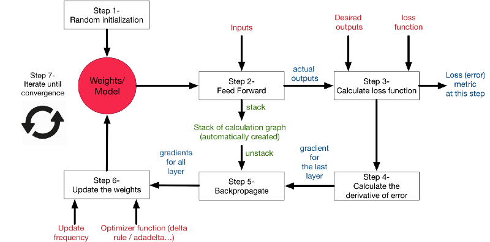

# Precificação de Opções via Redes Neurais {#redes-neurais}

```{r setup10, include = FALSE}
knitr::opts_chunk$set(echo = FALSE)

# Verifies if needed packages are installed
pkgs_att <- c("tidyverse", 
              "ggthemes",
              "kableExtra",
              "rio",
              "neuralnet")
new.pkgs <- pkgs_att[!(pkgs_att %in% .packages(all.available = TRUE))]

# Installs new packages
if (length(new.pkgs)) install.packages(new.pkgs)

# Loads and attaches all needed packages
for (s in pkgs_att) {
  if (!library(s, character.only = TRUE, logical.return = TRUE)) 
    stop("Error loading packages.")
}
```

Introduziremos neste capítulo[^101] um dos temas mais atuais no mercado financeiro. O uso de técnicas de inteligência artificial e aprendizado de máquina para a precificação de opções.

Em 1973, Fischer Black, Myron Scholes e Robert Merton publicaram uma maneira analítica para precificar opções, de modo que se pudesse relacionar a dinâmica do preço do ativo subjacente, uma taxa de juros livre de risco, o intervalo de tempo até a data de expiração da opção, o strike da opção e a volatilidade futura deste ativo, sem depender de um retorno esperado (algo muito mais imprevisível).
  

## Hipóteses de Black & Scholes

  Como já vimos em artigos anteriores, a fórmula de precificação de Black & Scholes [@Black1973] assumia a hipótese de lognormalidade para os retornos do ativo subjacente, além de que a volatilidade implícita do ativo se manteria constante para opções de um mesmo ativo e de mesmo moneyness. Em relação a hipótese de lognormalidade, isso nos diz que temos um método paramétrico de precificação, o que pode ser ruim (temos que assumir uma distribuição que não se ajusta com o que acontece nos mercados, que apresentam caudas longas), e a volatilidade implícita constante também não se concretiza, dando origem ao fenômeno chamado de “smile de volatilidade”, algo também já tratado nos nossos artigos antigos.
  

## Ensinando uma máquina a precificar opções

  Na década de 70, seria muito difícil construir um método prático e data-driven de precificação de opções, já que não se possuía poder computacional suficiente para realizar a mineração necessária; tínhamos que ter uma maneira analítica de precificação, o que começou com a fórmula de Black & Scholes (que garantiu o Prêmio Nobel aos pesquisadores). A partir da década de 90, com o avanço computacional, alguns pesquisadores começaram a se interessar por métodos data-driven de precificação, podendo se desvencilhar das hipóteses pouco realistas.
  
  Para tanto, podemos pensar em algumas possibilidades: tendo informações sobre as características de uma determinada opção (o seu preço de mercado, uma volatilidade implícita realizada, um determinado intervalo de tempo até a data de expiração, com o moneyness da opção, etc…), teríamos condições de ensinar um algoritmo a precificar esta opção? 
  

  Em [@Hutchinson1994], esta abordagem foi realizada com a utilização do método das redes neurais. A abordagem do pesquisadores do MIT era de ensinar uma máquina a precificar opções de maneira não-paramétrica e que não assumisse as hipóteses tão contestadas por outros pesquisadores. Colocando como input as informações teoricamente determinantes para os preços das opções, o artigo buscou ver o ajuste das previsões realizadas com o que realmente aconteceu nos mercados. Outro bom artigo, aplicando a mesma técnica mas para opções de outro mercado, é o de [@Huynh2018].
  

## Redes Neurais

  Como um resumo sobre o método das redes neurais, [@Friedman2001, 389] traz que a ideia é extrair combinações lineares entre as variáveis explicativas e então modelar a variável dependente (no nosso caso, o prêmio da opção) como uma função não-linear das variáveis explicativas.
O modelo de redes neurais também é chamado de multilayer perceptron, onde o modelo comprime diversas camadas de regressões logísticas com não-linearidades contínuas [@Bishop2006, 226]; assim é formada a função de máxima verossimilhança que é a base das “redes de treino”.

  Ao contrário do que se pensa, a pesquisa sobre métodos de inteligência artificial, e mais especificamente de redes neurais, começou já na década de 40, com [@Mcculloch1943], em “A Logical Calculus of The Ideas Immanent in Nervous Activity”. A ideia era de simular as redes neurais do cérebro como forma de computadores estarem aptos a aprenderem e tomarem decisões como um humano.
  
  Para isso, matematicamente, construímos uma função de ativação $y$, onde $y$ é uma função de uma função não-linear das combinações lineares entre os inputs dados  ($\phi(x)$), ponderada por pesos que, inicialmente, são aleatórios ($w_j$), entre 0 e 1. 
  
  
$$
y(\mathbf{x, w})=f\left(\sum_{j=1}^M w_j\phi_j(\mathbf{x})\right)
$$
  
  Esses pesos, com o método de treino estipulado (backpropagation), será alterado de forma com que se alcance o erro mínimo da função para os dados inseridos. Temos que M é o número de combinações lineares, que, somados, gerarão o primeiro input para o treino da função.

  
```{r rede-neural, fig.cap="Típica Rede Neural com uma camada oculta.", fig.align='center'}
knitr::include_graphics("./images/neural_network.png")
```
  

## Feed forward network

  Agora, derivando o algoritmo para chegarmos em $y(\mathbf{x, w})$, trazido acima:

  1º - Primeiramente, teremos o somatório da multiplicação do vetor de pesos $\mathbf{w}$ com o vetor de inputs $\mathbf{x}$. Temos que $w_{ji}$é um vetor de pesos que serão alterados ao longo do treinamento da rede. Faremos esse mesmo cálculo para todas as nossas variáveis
  
$$
  a_{ji} = \sum_{i = 0}^{D} w_{ji}^{(1)}x_i
$$

 2º - Temos de transformar o vetor de valores ponderados $a_{ji}$ através de uma função de ativação, que já é conhecido de econometristas e estudiosos da estatística: a função sigmoidal, que é a utilizada na regressão logística

$$
  \sigma(a) = \frac{1}{1 + exp(-a)}
$$
  
Com isso, temos então o que é chamado de “hidden layer”. 

  3º - Realizar novamente a ponderação dos valores, porém agora utilizando os hidden layers como input. 

Logo, teremos uma nova ativação dos outputs pela função sigmoidal, dado por um input de uma função sigmoidal anterior. Nesse caso, duas camadas da rede neural foram utilizadas. Desta forma, podemos combinar estas várias etapas e chegar nesta função para a rede neural:

$$
y(\mathbf{x, w})= \sigma(\sum_{j=0}^M w_{kj}^{(2)} \sigma(\sum_{i=0}^D w_{ji}^{(1)}x_i))
$$

  
## Backpropagation

Tendo um vetor de outputs, ou seja, valores preditos para o target utilizado, buscamos um vetor de pesos que minimize a seguinte função:

$$
E(\mathbf{w})= \frac{1}{2} \sum_{n=1}^N ||\mathbf{y(x_n, w) - t_n}||^2
$$

  Ou seja, sendo $y(\mathbf{x, w})$ um vetor de outputs e $\mathbf{t_n}$ o vetor dos targets iniciais, queremos minimizar a soma dos erros quadrados. Os parâmetros que são alteráveis são os pesos, tanto da primeira camada quanto da segunda utilizada. OBS: O fator (½) é adicionado para ser cancelado junto com o expoente durante a diferenciação

  A partir daqui, temos um problema computacional: simular infinitas possibilidades de vetores de pesos para identificar quais são os vetores que minimizam a soma do erro quadrado é uma tarefa computacionalmente exigente. Será que temos como usar a matemática para facilitar esse processo? 

  Para este problema, o método das redes neurais se utiliza do gradient descent, que é uma forma iterativa para se alcançar o mínimo de uma função.


```{r backpropagation, fig.cap="Esquema feed-forward e backpropagation.", fig.align='center'}

```
  Queremos encontrar os vetores de pesos que minimizem a função erro. Assim, aplicamos a regra da cadeia para derivar a função erro:

$$
{\frac {\partial E}{\partial w_{ij}}}={\frac {\partial E}{\partial o_{j}}}{\frac {\partial o_{j}}{\partial {\text{net}}_{j}}}{\frac {\partial {\text{net}}_{j}}{\partial w_{ij}}}
$$
  Sendo:
  
$$
1)
{\frac{\partial net_j}{\partial w_{ij}}}={\frac {\partial }{\partial w_{ij}}}\left(\sum _{k=1}^{n}w_{kj}o_{k}\right)
$$

que será simplesmente $o_k$, sendo $o_k$ um vetor que se for em relação a primeira camada, o input bruto; se for em relação a segunda layer, será o output da função de ativação.

$$
2)
{\frac{\partial o_j}{\partial net_{j}}}={\frac {\partial }{\partial net_{j}}} \varphi(net_j) = \varphi(net_j)(1 - \varphi(net_j))
$$

que é a derivada parcial da função de ativação (neste caso, a função sigmoidal), e a função abaixo, que é a derivada parcial da função perda:

$$
3)
{\frac{\partial E}{\partial o_{j}}}={\frac {\partial E }{\partial y}} = {\frac {\partial}{\partial y}} {\frac {1}{2}}(t - y)^2 = y - t
$$

Assim, atualizaremos os pesos com os resultados obtidos através da otimização, e seguiremos o processo iterativo de encontrar o mínimo da função. 

OBS: Um problema do método do gradient descent é que ele pode encontrar um mínimo local, não um mínimo global, que é o que nos interessaria. Há formas de contornar este problema, como, por exemplo, assumindo uma versão probabilística para a função perda. Dada a sua complexidade, deixaremos para artigos futuros a sua explicação. Além disso, outras formas de se alcançar melhores resultados com redes neurais para opções seria de segmentar as opções em ATM (at the money), OTM (out of the money), podendo captar melhor as características de ambas as situações.
  
## Rede neural no R

Os dados foram retirados do site [ivolatility.com](http://www.ivolatility.com/doc/usa/IV_Raw_Delta_surface.csv).

```{r, echo = TRUE, warning = FALSE}

##Importando os dados que serão utilizados

smile_volatilidade <- 
  rio::import("R/input/IV_Raw_Delta_surface.csv") %>%
  select(period, moneyness, iv) %>% 
  mutate(period = period/365)

##Executando o algoritmo através do pacote neuralnet
##Foram escolhidsa duas hidden layers para análise

rede_neural <- neuralnet(iv ~ period+moneyness, smile_volatilidade, hidden = 2)
iv_predito <- as.data.frame(rede_neural$net.result) 

df_nn <- cbind(smile_volatilidade$iv, iv_predito)

colnames(df_nn) <- c("volatilidade_implicita", "volatilidade_predita")

##Criando uma coluna com os erros da predição

df_nn <- df_nn %>% mutate(erro = volatilidade_implicita - volatilidade_predita)

hist(df_nn$erro,
     main = "Distribuição dos erros da volatilidade realizada pela predita",
     xlab = "Erro",
     ylab = "Frequência",
     xlim = c(-0.04, 0.04))

plot(rede_neural, rep = "best")
```

[^101]: Artigo originalmente escrito por Gabriel Dias, adaptado por Rafael F. Bressan para este livro.